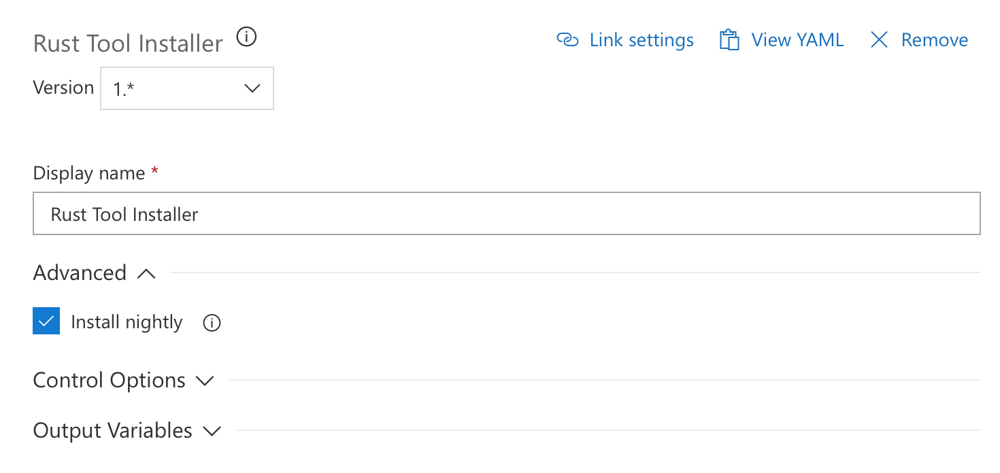
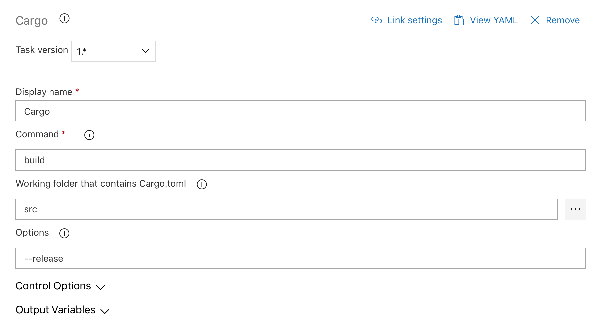
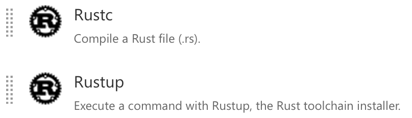

Rust 🦀
===

This extension contains tasks that can be used to manage **Rust** projects.

**Rust** is a systems programming language that runs blazingly fast, prevents segfaults, and guarantees thread safety. For more information on **Rust**, take a look at the official [documentation](https://www.rust-lang.org).

## Rust Tool Installer

The extension adds the **Rust Tool Installer** task inside the **Tool** category. It installs **rustup** and the latest version of the **Rust** toolchain. Always ensure you have run this task first, others need it to run.

By default, the task will install the latest stable version. You can also install the **nightly** one by changing the advanced settings:

## Cargo

**Cargo** task is available in the **Build** category.

Parameters:

- **Command**: Cargo subcommand to execute (example: build, test, update, install, doc...).
- **Options**: Subcommand options (optional).

## Other tasks

The extension also contains:

Those tasks can be used in the same way as the **Cargo** one.

## Features and bugs

You've got a feature request? You found a bug? 

Don't hesitate to create an issue on [github](https://github.com/spontoreau/rust-azure-devops/issues)!

## Like this extension?

- Don't forget to add a ⭐️ on [Github](https://github.com/spontoreau/rust-azure-devops)
- You can also ✍️ a [review](https://marketplace.visualstudio.com/items?itemName=spontoreau.rust-azure-devops#review-details)!
- Or share it on Twitter (cc [@spontoreau](https://twitter.com/spontoreau))
